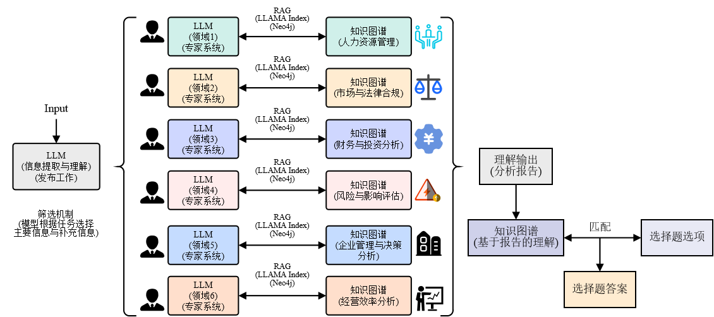
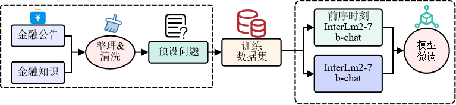

## 🛠️ FinSmart: 金融可信智能问答平台

## 简介

FinSmart：商业可信智能问答平台，是一款融汇商业、金融、法律等多元化知识的大语言模型。该平台以先进的InternLM2模型为基石，通过Xtuner技术的精准自蒸馏优化，大幅提升了模型的性能与准确性。同时，平台还构建了专业而系统的知识图谱，涵盖了金融领域的各个方面。通过这一知识图谱，FinSmart能够迅速而准确地从海量信息中召回相关知识，从而为用户提供精准、可信的问答服务。无论是商业分析、金融决策还是法律咨询，FinSmart都能为您提供及时、专业的解答，助您在金融领域取得更大的成功。

如果你觉得这个项目对你有帮助，欢迎 ⭐ Star，让更多的人发现它！




## 安装

#### 安装Neo4j数据库

参考地址：https://neo4j.com/docs/operations-manual/4.0/installation/linux/debian/

需安装6个Neo4j community版本数据库，设置地址相对应的六个不同端口，用以数据库信息的插入

具体参考文档：https://www.freesion.com/article/9620192600/

------

#### 下载模型

```
git lfs install
git clone https://code.openxlab.org.cn/limbo_11/Financial_Announcement_Analysis_Model.git
```

------

#### 安装相关依赖库

```shell
pip install -U xtuner
pip install -r requirements.txt
```


## 训练



#### Fine-tuning 

例如，我们可以使用自定义数据集启动 InternLM2-Chat-7B 的 LoRA 微调，方法是

```shell
export MKL_THREADING_LAYER=GNU
cd /home/pgpu/code/xtuner/examples/huggingface_trainer
python train_lora_hf.py \
  --model_name_or_path ${MODEL_PATH} \
  --dataset_name_or_path ${DATASET_PATH} \
  --per_device_train_batch_size  4 \
  --num_train_epochs 3 \
  --per_device_train_batch_size = 1 \
```

- 更多示例，请参见 [finetune.md](./docs/en/user_guides/finetune.md).

#### 对预训练LLM合并适配器

```shell
xtuner convert merge \
  ${NAME_OR_PATH_TO_LLM} \
  ${NAME_OR_PATH_TO_ADAPTER} \
  ${SAVE_PATH} \
  --max-shard-size 2GB
```

#### 开始聊天

```shell
xtuner chat ${NAME_OR_PATH_TO_LLM} --adapter {NAME_OR_PATH_TO_ADAPTER} [optional arguments]
```

------

#### 知识图谱构建

设置需要调用的模型（修改位置为模型的下载位置）：

```
tokenizer = AutoTokenizer.from_pretrained("/model/Weight/internlm2-chat-20b", trust_remote_code=True)
model = AutoModelForCausalLM.from_pretrained("/model/Weight/internlm2-chat-20b", device_map="auto",
                                             trust_remote_code=True, torch_dtype=torch.float16).eval()
model.generation_config = GenerationConfig.from_pretrained(f"/model/Weight/internlm2-chat-20b",
                                                           trust_remote_code=True)
embed_model = HuggingFaceEmbedding(model_name="/model/Weight/BAAI/bge-m3")
```

修改neo4j_demo配置：

```
username = "neo4j"                  #修改为Neo4j数据库用户名
password = "12345678"               #修改为Neo4j数据库密码
url = "neo4j://10.6.44.224:2222"    #修改为数据库ip以及端口
database = "neo4j"                  #修改为数据库名称

paths = ['/code/open_clip-main/IneternLM/book/经营分析/swfx.docx']  #修改为需要构建知识图谱的文档
```

构建知识图谱

```
python3 neo4j_demo
```


## 推理

### 选择题

此处使用LLM_choice.py 完成选择题推理

#### 修改配置

修改需要调用的模型地址

```
model_name = "internlm2-chat-20b"

tokenizer = AutoTokenizer.from_pretrained("/model/Weight/internlm2-chat-20b", trust_remote_code=True)
model = AutoModelForCausalLM.from_pretrained("/model/Weight/internlm2-chat-20b", device_map="auto",
                                             trust_remote_code=True, torch_dtype=torch.float16).eval()
model.generation_config = GenerationConfig.from_pretrained(f"/model/Weight/internlm2-chat-20b",
                                                           trust_remote_code=True)
embed_model = HuggingFaceEmbedding(model_name="/model/Weight/BAAI/bge-m3")
```

修改选择题xls地址

```
exl = pd.read_excel('/code/open_clip-main/IneternLM/choice.xls', engine='xlrd')
```

运行LLM_choice  完成选择题推理

```
python3 LLM_choice.py
```

### 问答

此处使用LLM_chat.py完成问答题推理

需要修改的东西同上，修改后运行

```
python3 LLM_chat.py
```


## 可视化

给出的回答位于./choice_text 与 ./chat_text


针对专家意见构建的知识图谱为于choice_graph与chat_graph


### 项目成员

- 黎宇轩 
- 陆思远 
- 李绮晴 
- 颜续添
